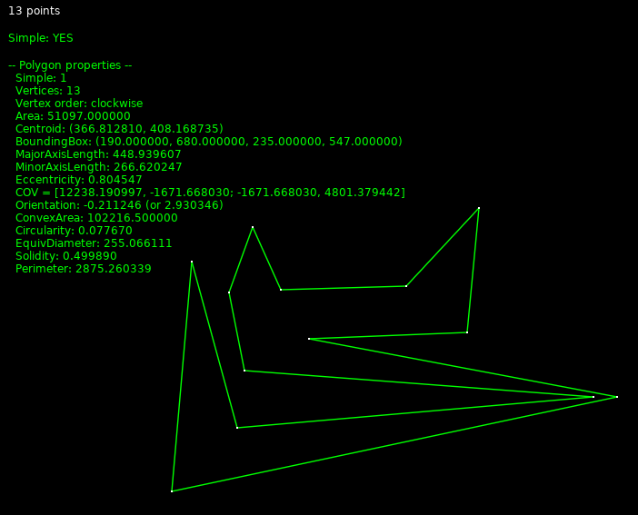

# poly2



A tiny library for feature extraction and manipulation of 2D polygons.

 - As you would expect it is only for simple polygons,
   i.e., with no crossing edges.
 - Moments are calculated using Greens theorem, and hence the orientation
   is important.
 - The orientation can be checked with `poly_vertex_order` and changed
   with `poly_reverse` if needed.

## Dependencies:
For basic measurements, no special dependencies. For interpolation:
gsl, for visualizations: libcairo, and libpango.

``` shell
# sudo apt-cache search ...
sudo apt-get install libpangocairo-1.0-0
```

## Lua/Löve demo
If [Löve](https://love2d.org/) is installed, there is a small test program in `src/love/` that can be run with.
``` shell
cd src
make lpoly.so
love love/is_simple/
```

## Relevant references:
 * [https://en.wikipedia.org/wiki/Image_moment](https://en.wikipedia.org/wiki/Image_moment)
 * [https://stats.stackexchange.com/questions/415974/how-to-find-the-covariance-matrix-of-a-polygon](https://stats.stackexchange.com/questions/415974/how-to-find-the-covariance-matrix-of-a-polygon)
 * [https://maxgoldste.in/melkman/](Melkman's algorithm interactively)

## To do
See the separate [TODO](TODO.md).
